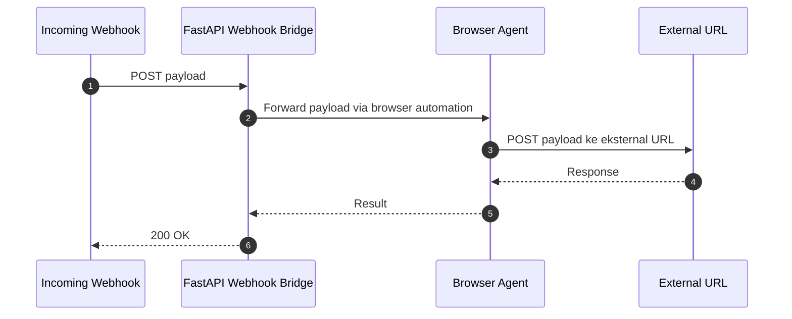

# Webhook Bridge dengan Browser Agent (Python)

Deskripsi singkat: Aplikasi Python yang menerima payload webhook (incoming) dan meneruskannya (outgoing) ke link eksternal dengan menggunakan browser automation sebagai agen outbound.

Fitur utama:
- Penerimaan webhook POST di endpoint /webhook
- Penerusan payload ke URL eksternal menggunakan browser otomatis (Playwright)
- Pelacakan log operasional
- Konfigurasi via variabel lingkungan (ENV)

Arsitektur singkat:
- FastAPI menjalankan server ASGI, dikelola dengan uvicorn
- Playwright digunakan untuk interaksi browser pada sisi outbound
- Outgoing request dikirim ke webhook_url yang ditentukan

Prasyarat:
- Python 3.10+ (Windows)
- PowerShell untuk menjalankan perintah (bukan CMD)
- Browsers via Playwright (Chromium/Firefox/WebKit)

Instalasi:
1) Buat virtual environment dan aktifkan
   uv venv
   .\venv\Scripts\Activate.ps1

2) Install dependensi
   uv pip install uvicorn fastapi[all] playwright httpx
   # Install browser binaries untuk Playwright
   python -m playwright install

3) Siapkan lingkungan eksekusi (contoh menggunakan file .env)
   PORT=3005
   WEBHOOK_URL=https://example.org/endpoint
   LOG_LEVEL=INFO

4) Jalankan aplikasi
   # PowerShell
   $env:PORT = 3005
   $env:WEBHOOK_URL = "https://example.org/endpoint"
   uvicorn main:app --host 0.0.0.0 --port $env:PORT

Menjalankan di Windows tanpa env file juga bisa dengan menyetel variabel sebelum menjalankan perintah.

Struktur Proyek (contoh minimal):
- main.py: Aplikasi FastAPI dengan endpoint /webhook
- requirements.txt: Daftar dependensi (jika digunakan)
- scripts/ atau app/ : Lokasi kode inti

Konfigurasi lingkungan:
- PORT: Nomor port server (default 3005 jika tidak diset)
- WEBHOOK_URL: URL tujuan untuk forward payload
- LOG_LEVEL: level logging (DEBUG, INFO, WARN, ERROR)

Endpoint API:
- POST /webhook
- Konten body berupa payload JSON webhook
- Aksi: log payload, forward ke WEBHOOK_URL menggunakan browser agent

Contoh payload:
{ "event": "example", "data": { "foo": "bar" } }

Contoh penggunaan forward:
- Arahkan Playwright untuk membuka WEBHOOK_URL dan kirim data dengan POST.

Logging:
- INFO: Server started on port 3005
- INFO: Received webhook payload from /webhook
- INFO: Forwarding payload to external URL via browser agent
- INFO: Forwarding response status: 200
- ERROR: Any failure will be logged with traceback

Pengujian cepat:
Buka terminal baru, jalankan:
Stop server dengan Ctrl+C di terminal, atau gunakan:
  taskkill /F /IM uvicorn.exe

Curl test:
curl -X POST http://localhost:3005/webhook -H "Content-Type: application/json" -d '{"event":"test","data":{}}'

Referensi file penting:
- File utama implementasi: [`main.py`](main.py:1)
- File dependensi (opsional): [`requirements.txt`](requirements.txt:1)
- README sekarang: [`README.md`](README.md:1)

Catatan:
Pastikan browser binaries terunduh dengan Playwright.

Penutup.
### Diagram Alur Data (Mermaid)

Referensi:
- [`main.py`](main.py:1)
- [`requirements.txt`](requirements.txt:1)